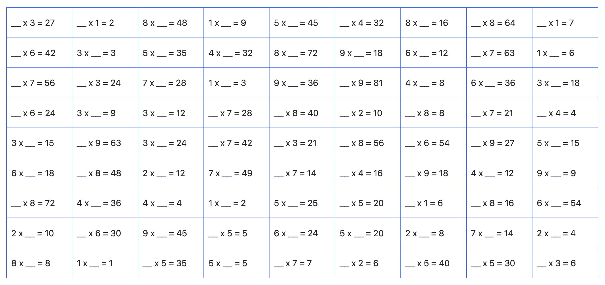

# math_for_kids

用于帮助小朋友学习数学的小项目。

## Usage

可以将本项目视作一个简单的出题器。

使用方法，通过浏览器打开 pages 目录下的 html 文件即可，会渲染出一张 A4 的页面。可以通过打印到纸张的方式给到小朋友做。
可以自行记录小朋友的正确率和用时，来判断小朋友对每一个章节的掌握程度。不要指望小朋友一次性做对，但求有进步即可。

### 加法

TBD
### 减法

TBD
### 乘法

1. pages/mul1.html 页面是一个有序的乘法表。小朋友可以从1x1，到9x9，逐步推理出结果来。

2. pages/mul2.html 页面是一个乱序的乘法表。小朋友在有序乘法上如果掌握得较好，就可以通过乱序的方式来让小朋友加深记忆。

### 除法

1. pages/mul3.html 文件就是除法出题器，只是以乘法的形式呈现的，主要是为了让小朋友暂时不用理解除法，只要在乘法的基础上进行反推即可。

## License
The [MIT](./LICENSE) license